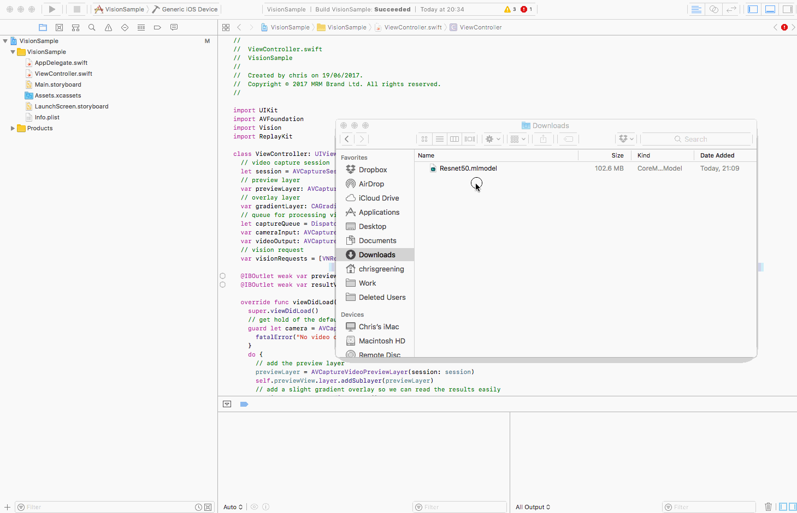

# saveSession-ARKit-CoreML
ArKit is Apple's platform for Augmented Reality, it can do amazing stuffs but it couldn't be used to add layers to the existing word, for example informations inside a museum because the position of the virtual objects is given by the GPS coords of the phone, thus the result is in the order of meters.

But, as shown in the video, using machine learning is possible to get a more precise position, in the order of centemeters, even where the GPS has no signal

[Demo Video - on Youtube](https://youtu.be/Q-FoqKHHUQw)

The aim of this project is to make an aumented reality apps in which every user can add and share layers to the real word, everywhere and in the most easy way possible.

If you want to participate, express your opinion of the project or just wanna talk contact me at alexlaconca@gmail.com

Based on [CoreML-in-ARKit by hanleyweng](https://github.com/hanleyweng/CoreML-in-ARKit)

Model: Inception V3

Language: Swift 4.0

Written in: Xcode 9.0

Content Technology: SceneKit

Tested on iPhone 6s running iOS 11.2.6 (15D100)

## Instructions

You'll have to download "Inceptionv3.mlmodel" from [Apple's Machine Learning page](https://developer.apple.com/machine-learning/), and copy it into your XCode project. (As depicted in the following gif)

[_(Gif via Atomic14)_](https://github.com/atomic14/VisionCoreMLSample)

If you're having issues, double check that the model is part of a target [(source: stackoverflow)](https://stackoverflow.com/questions/45884085/model-is-not-part-of-any-target-add-the-model-to-a-target-to-enable-generation).

## Footnotes

The Objects are the real objects seen by the camera
The anchor is an object that you set as the reference point the reference system in every sesson of ARKit
The nodes are arkit nodes composed by a point and a the name of an object
You can change the anchor using the change anchor button but the nodes will be resetted

Right now the orientation precision is given by by the precision of the compass, the more still you are the better the precision but it is planned the automatic addiction of multiple anchors to improve it
